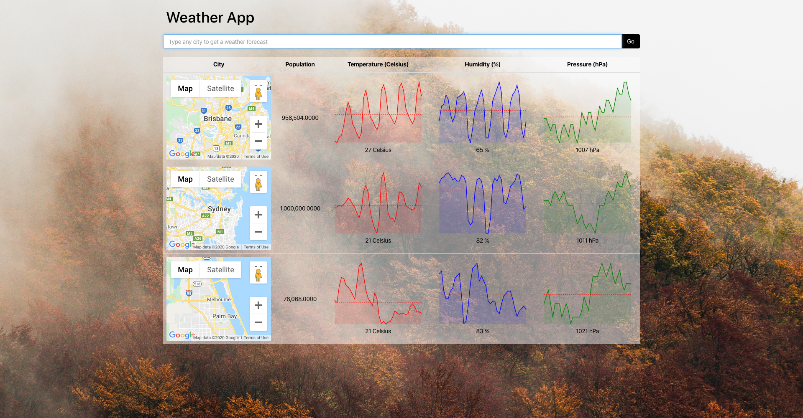

# Example Screenshot

Tech  

- NPM
- React
- Redux
- GoogleMaps API
- OpenWeatherMap API

### Notes:

Installed Packages:

Axios - Promise based HTTP Client
Lodash - A JavaScript Utility Library, this was used to deal with data from our api's
Redux-Promise - A library used to handle our action promises.
Redux-Thunk - Replacement for Redux-Promise, stopped the app from crashing when entering an unknown location / failed promise.
React-Redux - State Container for React
React-Sparklines - A package that allows the creation of graphics (In this app, for temp, pressure etc)

### Components

Reusable sections of our application pieced together using React

### Store

The `Store` is the globalized state of our applications data, once data is stored within the store we're able to access it from anywhere within our App.

### Actions

An `Action` describes what you want the App to do, the action will have a name. Name is often described as "type". Actions are later called by the `Reducer`

### Reducers

The `Reducer` will check what `Action` is called, based on that action it will modify the `Store`  
At the end of a `Reducer` the data is sent to the `Store` to be saved.

### Dispatch

A `Dispatch` executes the action to the reducer.

### Provider

The `Provider` allows us to connect our global `State/Store` to our entire app.
